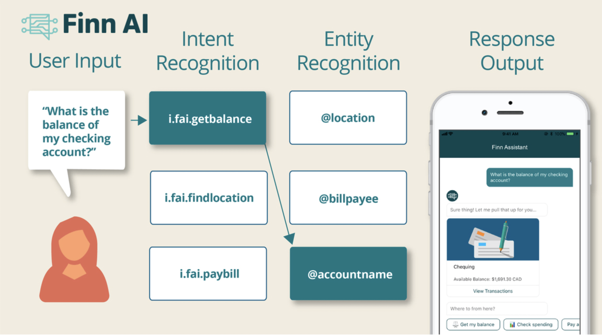
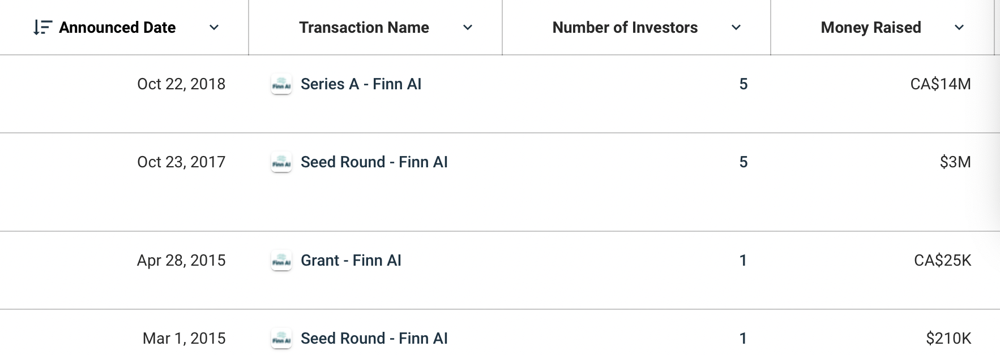

# AI Powered Chat Bots in Banking and Finance Domain
----------------------------------------------------
### **"FINN AI"** is the name of the Company 
##### formerly known as PAYSO

### Overview and Origin
Finn AI’s purpose-built banking chatbot provides optimized, out-of-the-box support for the most common banking tasks and queries, delivering the best ROI in the industry.

Finn AI was founded to provide support to financial institutions so that their customers can easily manage their money and improve their financial literacy. 

The enterprise operates on a subscription-based SaaS model which uses modern cloud infrastructure to develop, deploy and upgrade each virtual assistant across different global regions. It can be easily utilized on bank’s digital channels including Website and Mobile Banking apps (Android and iOS).

Leveraging Artificial Intelligence, Machine Learning and the deepest banking domain expertise in the industry to build conversational bots so that customers can easily manage their money and improve their financial literacy thereby also benefitting banks to have efficient management of time and resource in serving the customers where needed. 

## Finn AI was incorporated in 2014 
    - An award-winning, AI-powered virtual assistant built for personal banking and finance. 
    - Virtual Banking Assistant bot puts a personal banker in every bank customer’s pocket, helping them to manage their money wherever they are, whatever they need – via a simple, natural conversation.

## Founders of the company
### Jake Tyler, 
##### Co-Founder & CEO  

### Natalie Cartwright, 
##### Co-Founder & COO

### Guru Atlu
##### Co-Founder & CTO

### Idea for the company (or project) come about is explained here 
    One of the class activities in the first week of the Bootcamp was to explore Fin Tech in the future and when discussing that at home with family on the next day, my idea was to develop a bot which could act as a Personal Finance Virtaul Assistant for Digital Banking and while googling for the week 1 case study, came across this organisation in Canada and selected that for case study 

## Funding of the Company
    Finn AI is a venture-backed with investments by Yaletown Partners, Flying Fish Partners. BDC Capital, and 1843 Capital etc with a total of 10 investors.

    Finn AI has raised a total of $13.9M in funding over 4 rounds. 
[#Finn AI Investors List can be found here ](https://www.crunchbase.com/organization/finn-ai/company_financials)

## Business Activities:

### Challenge or the problem that is been faced and to be solved could be listed below

    Chatbots may respond to questions like “What is my balance?” or “When is my bill due?” They also typically pose the
    same questions to all customers regardless of their situation. If an interaction demands more complexity or if the user asks the question not exactly the way the chatbot expected (such as “how much cash do I have” vs. “what is my balance”), customers may be out of luck, leaving them to frantically type or say “agent” to escalate their inquiry. 

    In addition, the chatbot capabilities may not be easily discoverable, which contributes to customer frustrations.

    This only means the AI dictionary needs to be strengthened to handle these challenges in future in such a way that human intervention still could be reduced 

### Company's intended customerand the market size of this set of customers

    Intended Customers are Banks, Credit Unions and Challenger Banks

    Some of the Banks are:
        - ATB Financial => 700,000+ Members
        - BanPro => 380,000+ Members
        - Top 3 US Card Issuer => 112 Million Customers
        
    Some of the Challenger Banks are:  
        - KOHO => 220,000+ Customers
        - Tyme Bank => 1,000,000+ Customers
        - Fidor Bank => 400,000+ Customers 

    Finn AI's main competitors are: 
        - Abe AI, 
        - Personetics and KasistoActive AI, 
        - Ambit AI, 
        - Automat, 
        - Giosg.com

    Banks and credit unions are rapidly adopting chatbots to improve self service capabilities but face challenges integrating chatbots into authenticated online and mobile banking channels. 

    Finn AI has offered to built an integration with Q2 Digital Banking using the Q2 Caliper SDK to overcome this, enabling Q2 customers to easily and quickly add a best-in-class banking chatbot to their prime digital channels.

    This integrated product is a true virtual banking assistant, capable of handling thousands of common banking queries and tasks including authenticated actions like checking balances, putting a hold on a card, and changing account details

### Technologies used 

    Finn AI chat bots,  which is a lot of artificial intelligence and machine learning.
    It also uses 32 technology products and services including HTML5, Google Analytics, jQuery and also include Viewport Meta, IPhone / Mobile Compatible, SPF  
    The technologies that are used by Finn AI are: Terminus, WordPress, Cloudflare CDN, Google Font API

#### Implementation of Data Security & Privacy
    
    Encryption at rest and in transit ensures data remains private and secure as it passes through the digital banking API infrastructure.

    Using Auth0, a global leader in Identity-as-a-Service (IDaaS)'s authentication platform
    Auth0 enables single sign-on across multiple apps and is a single source of truth for all digital identities

## Landscape:

### About the Financial Domain of the Company 

    Digital Banking, Robo-Advisors, AI, Machine Learning  => AI banking chatbot is an AI-driven conversational assistant – built specifically for banks and credit unions – that enhances the customer experience by using easy to understand language to improve digital engagement. Each Finn AI virtual assistant is trained in banking “out of the box” and aggregates data from all customers for a dedicated library of banking-specific inquiries and pre-defined responses.

### The major trends and innovations of this domain over the last 5-10 years

    Recent developments in technology have given chatbots more power in interpreting natural language
    and machine learning. 
    Major companies like Facebook, Google, Amazon, Apple, and Microsoft are leading contributors in the development of futuristic chatbots, and are working on enabling advanced
    interactions between consumers and machines with commercially-viable business models.
    These chatbots are able to understand conversational language, retain context over a conversation, and
    handle complex requests, making them a viable option for implementation in critical applications
    such as managing wealth.

## Results

### The business impact of this company so far
    Conversational AI innovator – and being multiple-time Finovate Best of Show winner, Finn AI has impacted as below - 
    "United Federal Credit Union (UFCU) is a Q2 digital banking client that has now implemented Finn AI’s Banking Chatbot to enhance member experience. Using Finn AI has enabled UFCU to give members a safe, conversational experience and free up their call center team for better service. Members responded positively with a 264% increase in online chat volume compared to 2019"

    Finn AI works with banks to help their users improve their financial well-being and also help banks move 
    up the value chain

    There’s lots of information about how you’re spending money, where you’re spending money, where you might be having trouble with your money, and there’s lots of ways to serve that data back to people in a proactive way, so they can avoid certain situations or optimize their finances. 

    But the principle will be that you have to provide a much more proactive and predictive experience for customers when you’re using their data and that can play out in lots of different ways.

    - Reduce average handling time (AHT) by 75%
    - Drives Effeciency: chatbots contain 75% of conversations without a human
    - Improve Service Experience: 24/7, instant answers using simple natural language

### Some of the core metrics that companies in this domain use to measure success and how Finn AI is performing based on that

### How Finn AI Bank and CU Customers are Achieving Chatbot Success and Company performance relative to competitors in the same domain

    - Scaling to Meet Demand - Increasing customer demand and operational challenges from the pandemic spur chatbot use1 , 2 0 0 , 0 0 0 - Annual engaged sessions, across all Finn AI customers
    - 26% Q/Q increase in chatbot sessions across Finn AI customers.
    - Transactions were completed with no human support (3Q2020) 
    
### More Benefits for Finn AI Bank and CU customers as below
    
    - 150,000 conversations completed without human support
    - 68% no human support involved
    - $750,000 call center staff time FOR FINN AI saved
    - 1.3 Million minutes of customer time saved (3Q2020)
    - 5x faster resolution of inquiries - meaning  
        Chat resolution averages 2.1 minutes.
        Talking to a live agent averages 10.2 minutes
        Finn AI Chatbots are saving customers 8.1 minutes per call 
### More Benefits for Bankers are:

    - Deflect 2/3 of requests to automated assistants, allowing call center agents to handle issues where they can add real value with personal service    
    - Deliver automated service during non-business hours
    - Offer advanced digital service comparable to the biggest banks, without internal investment in AI and R&D
    - Respond to volume increases faster than staffing levels can be increased

### More Benefits for Customers are:

    - Reduce customer waiting time
    - Let customers conduct transaction such as transfers, payments, and balance inquiries using the natural language they prefer
    - Get self-service answers up to 5X faster for routine requests
    - Let customers ask in their own words how to best navigate
    online banking

## Recommendations

### Products or services that could be suggested is as below

    Communication or Interaction between Chat-Bots within the same company products or between other organisations within the same domain depending on the need like "Apple Siri" talking to "Google Home"  - for example: if the customer enquires about interest rate for a loan amount, the chat bot could display results from various banks and give a varied or comparison charts for the customer to make a quick decision, this could be implemeted in other domains like real estate or wealth management etc 

### Offering this product or service would benefit the company in the below ways 

    - Stand out from competetive financial institutions with simple experiences that support financial health
    - Use new onboarding channels to acquire customers. Retain them with a fully integrated Virtual Financial Assistant that is always there to help.
    - Acquire new customers in conversational channels
    - Retain customers with digital experiences focused on financial health
    - Give customers more self-service options
    - Out-of-the-box engagement across all business units

    The product is customer focussed and the benefits result is like "Happy Customer - Happy Business" as this is targeted to "how happy did I make this customer today?" thereby increasing the revenue growth of the Organisation 

    Let's face it, managing money can be difficult. By incorporating a focused AI engine, better data & insights, and deep integrations into Fintech banking, financial institutions can proactively support and engage their customers to create a simple user experience - in the channels they prefer.

####
 Technologies that this additional product could utilize are

    Blockchain and Python

    Blockchain could enable easier flow of data communications between systems and using Python could also make it easier to integrate systems with its in built algorithms 

----------------------------------------------

Resources: 

https://www.finn.ai/files/Finn-AI-Chatbot-Success.pdf

https://yourstory.com/companies/finn-ai/amp

https://www.prweb.com/releases/finn_ai_report_eight_considerations_for_conversational_ai_in_banking/prweb17580146.htm

https://www.crunchbase.com/organization/finn-ai/company_financials

https://finovate.com/best-of-show-winner-finn-ai-partners-with-idaas-firm-autho/

https://www.owler.com/company/finnai#news

https://www.globenewswire.com/news-release/2019/02/26/1742492/0/en/Auth0-Partners-with-Finn-AI-on-Authentication-for-Conversational-AI.html

https://www.temenos.com/news/2019/05/07/finn-ai-named-a-2019-cool-vendor-in-ai-for-banking-and-investment-services-by-gartner/

>Words from the Founders of Finn AI 
 
<em>
    During their difficult times - “You have to put in the hard boundaries and then show kindness where you can... We tried to do what we could to be human and support people and to let them know it wasn’t about them.”  
</em>
 
<em>
During their win-win times - A beautiful sentiment from their team, and a great example to us all: "It’s possible to achieve great success, make the tough calls, and still keep human dignity at the forefront."
</em>